  <picture>
    <source media="(max-width: 760px) and (prefers-color-scheme: dark)" srcset="./assets/hero/agent-console-081084b7-mobile-dark.svg">
    <source media="(max-width: 760px)" srcset="./assets/hero/agent-console-081084b7-mobile-light.svg">
    <source media="(prefers-color-scheme: dark)" srcset="./assets/hero/agent-console-081084b7-dark.svg">
    <source media="(prefers-color-scheme: light)" srcset="./assets/hero/agent-console-081084b7-light.svg">
    
  </picture>

  
  
  

## About Me

I design agentic AI systems and workflow automation with Claude Code, n8n, and LangChain, removing 10-40 hours of manual work per week for digital businesses.

My work is backed by hands-on research: first author of a published edge AI computer vision paper and an IEEE YESIST12 2026 grand finalist, selected from 2,000+ submissions.

## Current Focus

| Area | What I am exploring |
| --- | --- |
| **Agentic AI Development** | Claude Code, OpenCode, AI pair-programming, and multi-step task automation. |
| **Workflow Automation** | n8n and LangChain pipelines that connect business tools end-to-end and remove repetitive work. |
| **ML & Computer Vision** | Model optimization (pruning & quantization) with MobileNetV2 for edge AI deployment. |

## Featured Work

| Project | Focus | Why it matters |
| --- | --- | --- |
| [**MediSense PWA**](https://github.com/NDP4/medisense-pwa) | AI healthcare triage PWA | AI-powered medical triage platform for remote regions, running 100% offline via TensorFlow.js on entry-level smartphones. |
| [**Rice Leaf Edge AI**](https://github.com/NDP4/rice-leaf-disease-edge-ai) | Edge AI for rice leaf disease | Optimized MobileNetV2 for low-resource edge deployment via channel pruning and PTQ, published in SKANIKA. |
| [**CompanyLock**](https://github.com/NDP4/CompanyLock) | Workstation security & access control | Centralized security platform featuring real-time monitoring via SignalR, time-based access control, and web-based management. |

## Research Direction

I focus on turning AI capabilities into dependable automation: agents that observe state, use tools, evaluate their own output, and hand off cleanly to the people who own the process.

## Tech Stack

`Python` · `n8n` · `LangChain` · `Claude Code` · `Next.js` · `Supabase` · `Flutter`

## Recent Activity

<!-- AUTO:ACTIVITY:START -->
- Sep 12, 2026: pushed 1 commit to [NDP4/NDP4](https://github.com/NDP4/NDP4).
- Sep 12, 2026: pushed 1 commit to [NDP4/rice-leaf-disease-edge-ai](https://github.com/NDP4/rice-leaf-disease-edge-ai).
- Sep 10, 2026: created a branch in [NDP4/gpu-switcher-linux](https://github.com/NDP4/gpu-switcher-linux).
- Sep 7, 2026: pushed 1 commit to [NDP4/gods-eye-view](https://github.com/NDP4/gods-eye-view).
<!-- AUTO:ACTIVITY:END -->

---

  Automating what matters, shipping what works.

